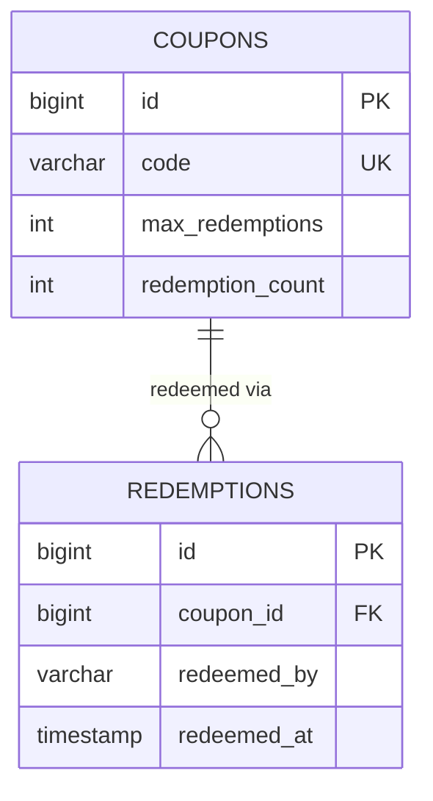

# Entity Relationship Diagram

Reflects the schema defined in [`V1__init_schema.sql`](../src/main/resources/db/migration/V1__init_schema.sql).

## Table notes

### `coupons`

- `code` is `UNIQUE` (`UK`) — it's the business key `Coupon.equals`/`hashCode` compares on, so two `Coupon` objects with the same code are considered the same coupon regardless of how many times either has been redeemed.
- `max_redemptions` is the limit ("N") a coupon may be redeemed. `CHECK (max_redemptions >= 0)` rules out a negative limit; `0` is allowed on purpose (see [README](../README.md#domain-model) — a coupon that's exhausted from the moment it's created is a valid edge case, not an error).
- `redemption_count` is the running total this whole domain exists to exercise. `CHECK (redemption_count >= 0)` rules out a negative count, and the important one, `CHECK (redemption_count <= max_redemptions)`, is the database's own independent copy of the exact boundary `Coupon.redeem()` enforces in Java — see [Two enforcements of one invariant](#two-enforcements-of-one-invariant) below.
- There is deliberately **no** `updated_at`/`version` column yet. `redemption_count` is mutated by ordinary `UPDATE` statements with no optimistic-locking guard, which is fine for the sequential, single-threaded scenario this layer's tests cover, but is exactly the gap called out under [What's not tested here](../README.md#whats-not-tested-here) — two concurrent redemptions racing for the last remaining use is a real bug class this schema does not yet defend against.

### `redemptions`

- `coupon_id` is a `NOT NULL` foreign key to `coupons.id` — every redemption belongs to exactly one coupon, there's no "orphaned" redemption.
- `redeemed_by` identifies who redeemed the coupon (an email, a customer id — whatever the caller supplies; this layer doesn't validate its shape beyond "not blank," see `Redemption`'s constructor).
- `redeemed_at` is a plain `timestamp`, always set by the application (`Redemption`'s constructor calls `Instant.now()`) rather than a database default — see the [README](../README.md#code-walkthrough) for why that choice was made specifically so it could be unit tested without a database.
- `idx_redemptions_coupon_id` backs every query that looks up a coupon's redemptions: `RedemptionRepository.findByCouponIdOrderByRedeemedAtAsc`, `countByCouponId`, `findRecentForCoupon`, and `findDailyRedemptionCounts` (see [queries.md](queries.md)) all filter on this column.
- There is no unique constraint on `(coupon_id, redeemed_by)` — the same person redeeming the same coupon twice is allowed at the schema level. Whether that should be blocked (e.g., "one redemption per customer per coupon") is a business rule that belongs in a future service layer, not this one.

## Two enforcements of one invariant

The boundary this whole app is named for — "the Nth redemption succeeds, the (N+1)th fails" — is expressed **twice**, independently, in two different languages:

1. **In Java**, `Coupon.redeem()` checks `redemptionCount >= maxRedemptions` before incrementing, and throws `CouponExhaustedException` instead if the coupon is already exhausted.
2. **In SQL**, `chk_coupons_redemption_count_within_limit CHECK (redemption_count <= max_redemptions)` rejects any `INSERT`/`UPDATE` that would leave the row in that state, regardless of what Java code ran (or didn't run) beforehand.

Neither one supersedes the other. The Java check is what a caller actually experiences (a clean, catchable exception, with a clear message, before anything is written) and it's what this layer's unit tests exercise directly. The SQL check is a safety net that only matters if some future code path — a bulk import, a manual `UPDATE`, a bug that bypasses `redeem()` — tries to write past the limit anyway. Proving the SQL constraint actually fires requires an `INSERT`/`UPDATE` against a real database, which is an integration test, not a unit test — see [What's not tested here](../README.md#whats-not-tested-here).

## Why no `@OneToMany` from `Coupon` to `Redemption`

`Coupon` has no `List<Redemption> redemptions` field, even though the foreign key would support one. This is the same design choice `Loan`'s owners make in the sibling "team-org-hierarchy" and "library" lessons: keeping the reference one-directional (`Redemption` points at `Coupon`, not the other way around) avoids the classic JPA trap of a huge, easy-to-accidentally-load (or accidentally-not-load) collection sitting on an entity that's otherwise cheap to fetch. Anything that needs "how many redemptions does this coupon have" asks the database directly — `RedemptionRepository.countByCouponId`, or the native `findRedemptionSummaries` aggregate — rather than loading every `Redemption` row into memory just to call `.size()`. It's also *why* `findRedemptionSummaries()` has to be a native query in the first place: there's no `coupon.redemptions` JPQL path to `COUNT()` over (see [queries.md](queries.md)).
