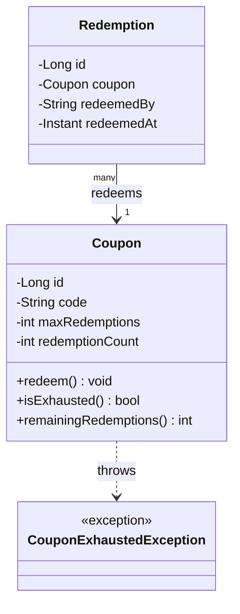
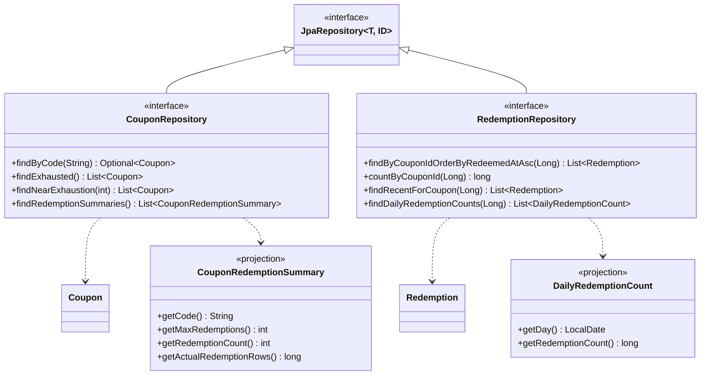

# UML Class Diagram

The same model as [erd.md](erd.md), but as Java objects rather than tables: which side owns which reference, and where the counting behavior actually lives.

## Notation

- `-` private field, `+` public method.
- `-->` association: `Redemption.coupon` is a plain `@ManyToOne` reference — a foreign key in Java form, nothing cascading and no ownership implied in either direction.
- `..>` dependency: `Coupon.redeem()` doesn't hold a reference to `CouponExhaustedException`, it just constructs and throws one when it needs to.
- There's no `*--` (composition) anywhere in this diagram, unlike the `PurchaseOrder`/`PurchaseOrderLine` relationship in the inventory lesson — a `Redemption` is never created *through* `Coupon` (no `coupon.addRedemption(...)` method exists), so there's no parent managing a child collection's lifecycle to depict. Wiring "redeem, then record" together is explicitly future, service-layer work (see the [README](../README.md#code-walkthrough)).

## Where the counting logic lives — and where it deliberately doesn't

`Coupon` is the only class with behavior; `Redemption` is a plain data holder (a constructor plus getters). That split is deliberate:

- **`Coupon.redemptionCount`** is the single source of truth for "how many redemptions has this coupon used." It's a denormalized counter — a number that could, in principle, always be recomputed by counting `Redemption` rows — kept on the entity itself so `redeem()` can check it and update it in one step, in memory, with no query round-trip.
- **`Coupon.redeem()`** is check-then-increment, in that order, as a single method call: `if (isExhausted()) throw ...; redemptionCount++;`. There is no separate "can I redeem?" method a caller could check and then race against — the only way to find out if a coupon has room left is to attempt `redeem()` and see whether it throws. That's what makes the boundary testable with total precision: call it exactly `maxRedemptions` times and assert success every time, then assert the very next call throws and changes nothing.
- **`Redemption` has no logic at all** — no validation beyond "these fields must be non-null/non-blank" in its constructor, and no method that could ever fail a business rule. It exists purely to be a fact: this coupon, this redeemer, this instant. Whether that fact *should* be recorded is entirely `Coupon.redeem()`'s decision, made before a `Redemption` would ever be constructed in a real flow.

This mirrors the `Product`/`StockMovement` split from the inventory-purchase-order lesson: `Product.stockQuantity` is the counter, `StockMovement` is the audit trail, and `Product.decreaseStock()` is the one method both permission and mutation are decided in. `Coupon`/`Redemption`/`redeem()` are the same shape, just applied to "redemptions remaining" instead of "units in stock."

## Repository interfaces

Spring Data repositories aren't part of the object model above, but they're the other half of the persistence layer — one interface per entity, each extending `JpaRepository<T, Long>` for free CRUD, plus the query methods described in [queries.md](queries.md).

`findByCode` is the only method Spring Data derives purely from its name — no `@NamedQuery` or `@Query` involved anywhere. Every other method here is either a named query resolved from an `@NamedQuery` declared on `Coupon` or `Redemption`, or a native query with an explicit `@Query(nativeQuery = true)`. See [queries.md](queries.md) for which is which, and why each one is built the way it is.
